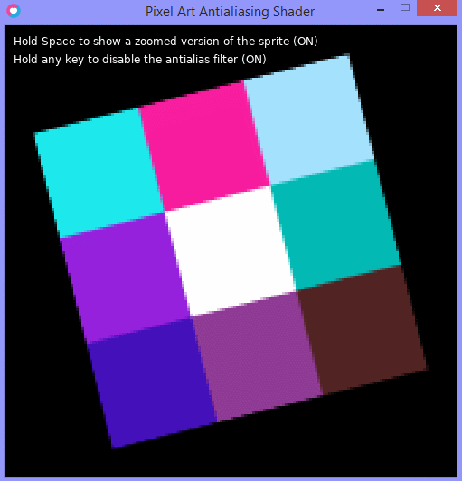

# Pixel Art Antialias Shader
LÖVE (Love2D) example of an antialiasing shader for use with 2.5D pixel art (smooth scrolling and scaling). You can adjust the filter size to get sharper or smoother results, or just use the default size for exact results.

Download [main.lua](https://github.com/RNavega/PixelArt-Antialias-Love2D/raw/master/main.lua) into some folder and [use the love runtime on that folder](https://love2d.org/wiki/Getting_Started) to run it.

